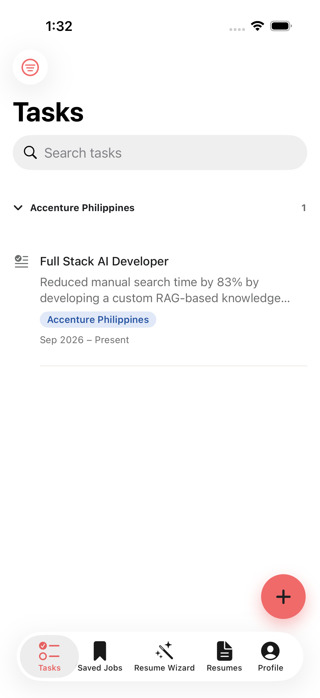
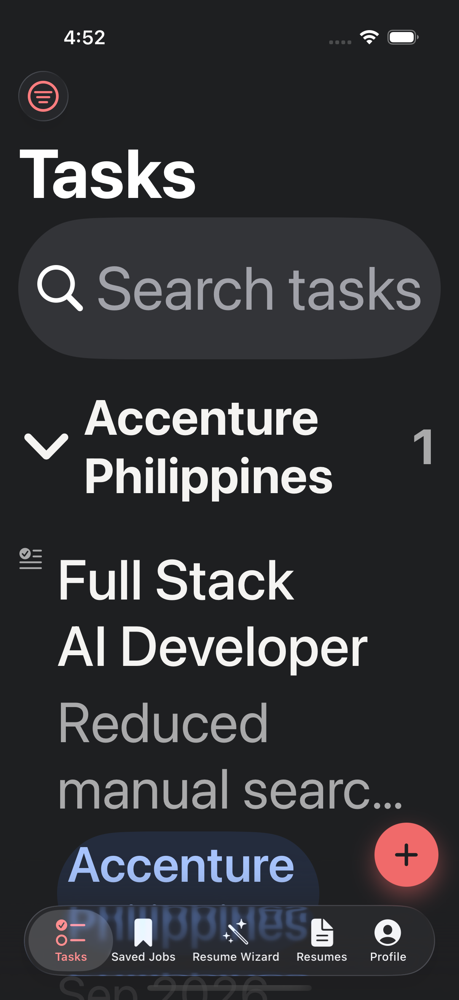
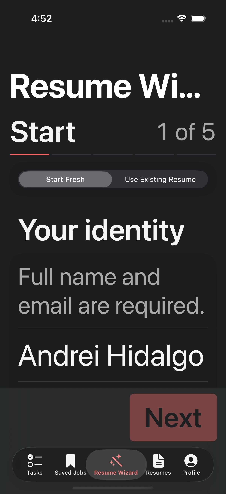
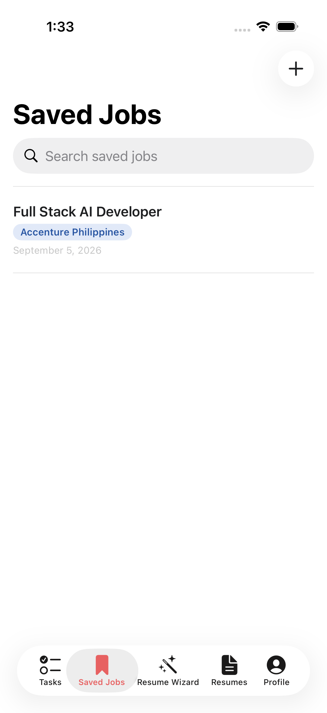
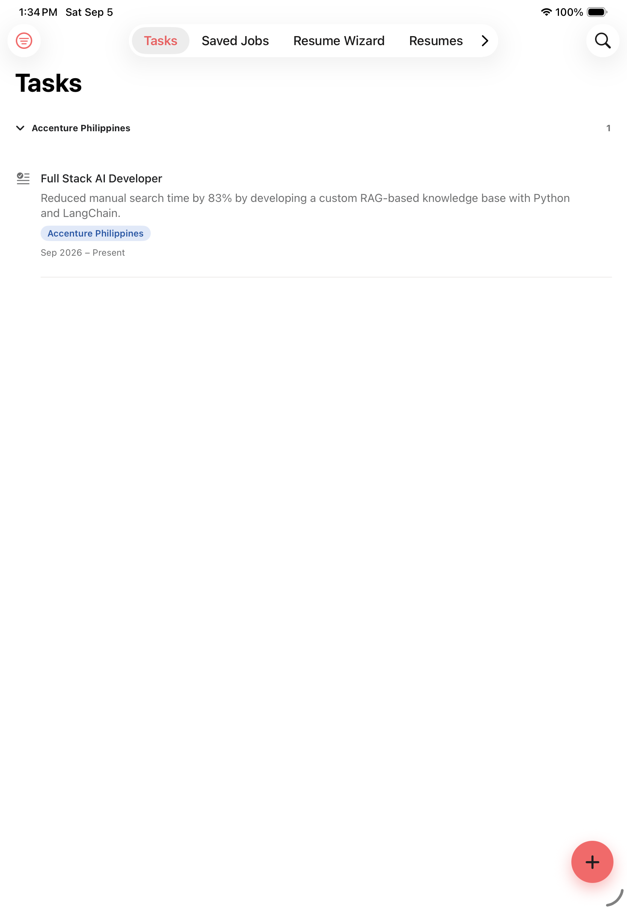

# Annotated screenshot index

This audit folder is new; prior binary artifacts remain in `design-audit/` and are linked here rather than overwritten. The annotations identify what each image establishes and what it cannot establish.

| Figure | Image | Annotation / linked finding |
|---|---|---|
| 1 |  | Tasks hierarchy, grouped rows, and floating Add action are visible. Supports positive patterns; does not test keyboard or VoiceOver. |
| 2 |  | Corrected charcoal canvas and large-text Tasks layout. Supports appearance baseline; does not certify every screen. |
| 3 |  | Wizard progress and dark large-text hierarchy. Supports P1/P2 evidence boundary; gesture behavior is not visible in a still. |
| 4 |  | Saved Jobs list and date treatment. Supports coverage; populated detail/delete states remain unverified. |
| 5 |  | Wide iPad reading row and native tab/navigation adaptation. Supports P2 readable-width review. |
| 6 |  | Manifest labels this Profile, but prior review identifies the rendered screen as Resumes. This is evidence of a coverage gap, not Profile validation. |

## Missing captures to add in the next verification pass

- Profile with About icons, provider selector, model picker, configured key, edit/delete key sheet, and error state.
- Narrow iPhone and accessibility XXXL API-key action row.
- Keyboard-visible Add Task, Add Job, Profile edit, and Wizard fields.
- Landscape iPhone and narrow resizable iPad for all five tabs.
- Reduce Transparency and VoiceOver accessibility hierarchy snapshots.

